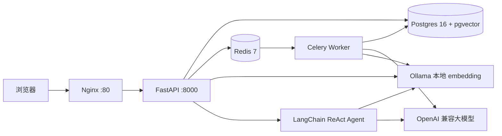

# AI 简历分析 + AI 模拟面试

[](https://github.com/witwarmthhumor/AIResume-analysis-platform-AI-/actions/workflows/ci.yml)

面向求职者的简历智能分析与文字模拟面试工具，定位为个人学习与求职作品集项目。

## 当前功能

- 文本型 PDF 简历上传、解析、5MB/5页限制与 hash 去重
- AI 简历分析：岗位匹配、优势、短板、关键词缺口、改进建议、预测面试题
- 多轮文字模拟面试：SSE 流式回复、消息恢复、结束评价，支持智能出题（实习/校招/社招）
- 用户注册/登录、JWT、用户数据隔离、个人中心（本人五卡统计 + 近 7 日用量）
- 🧪 **知识库问答 / 在线对话**（v3.0 → v3.1 → v3.5）：基于预置语料库（面试题/八股文/岗位 JD）+ 用户上传文档，**混合检索（向量 + BM25，RRF 融合）** + RAG 流式回答，带引用来源；**多会话管理**（新建/切换/删除，标题自动生成）
- 🤖 **AI 客服 Agent**（v3.4 → v3.6）：基于 LangChain 0.3 ReAct Agent，**SSE 流式输出 + 工具调用过程可见**，会话历史持久化；**11 个工具**——检索/查询类 7 个（知识库检索 / 我的简历 / 我的面试记录 / 评分趋势 / 我的用量 / 读分析报告 / 语料清单）+ 平台功能说明 1 个 + 工具内 LLM 类 3 个（岗位匹配 job_match / 出题 question_gen / 回答点评 answer_review，独立限额）；工具路由实测 33/33 = 100%；用户端整页形态 + 管理端右下角悬浮形态
- 🚀 **一键求职准备**（v4.0 LangGraph 试点）：AI 客服页新页签，贴入 JD 后自动串起「读简历 →（补）AI 分析 → 岗位匹配 → 定制出题 → 整理交付」，步骤条实时流转；**创建面试场次前先弹审批卡（TTL 倒计时，批准才建场次）**；失败自动回环重试（≤2 次）并可从失败节点续跑；结果分区展示分析/匹配（命中词、缺口词）/出题（含出题依据）；LangGraph 0.2.76 + PostgresSaver 断点续跑，全程 trace span 落库可回看
- 📊 **数据看板**（v3.2）与 📋 **使用日志**（v3.3）：五卡统计 + 用户列表分页 + 近 7 日用量柱状图；使用明细支持动作/模型/IP/日期范围筛选与后端分页
- 📈 **面试复盘雷达图**（v3.5）：结束评价的四维度评分可视化，可叠加本人历史场次对比
- 🔀 **分析版本对比**（v3.5）：同一份简历历次分析（不同提示词版本）并排对比，标出各自独有条目
- 🗂 **语料库管理**（v3.1）：管理端可查看全部文档（含预置与所有用户上传）并删除，上传可直接入预置语料
- 双端导航分离：管理端五项（首页/在线对话/使用日志/数据看板/语料库管理），普通用户三项（首页/AI 客服/个人中心）
- Redis + Celery 异步任务基础

## 技术栈

- 后端：Python + FastAPI + PostgreSQL（pgvector）+ SQLAlchemy / Alembic
- 前端：Vue 3 + Vite（零 UI 框架，手写 CSS 设计系统），生产环境由 Nginx 提供静态文件并反代 `/api`
- 异步：Redis 7 + Celery
- AI：国产大模型 OpenAI 兼容协议（当前 DeepSeek，可切换通义）
- Agent（v3.4）：LangChain 0.3 稳定线（`langchain` / `langchain-openai` 锁 `<0.4`）+ ReAct AgentExecutor，SSE 流式
- Agent v2（v4.0 试点）：**LangGraph 0.2.76**（pin，不升 1.x）+ PostgresSaver 断点持久化 + interrupt/Command 人机协同；与 v1 双轨并存（`agent_v2_enabled` 开关，v2 异常不影响 v1）
- Embedding（v3.0）：Ollama 本地 nomic-embed-text（768 维，OpenAI 兼容 API），pgvector HNSW 向量检索；可切云端 embedding

## 生产 Docker 一键启动

前置：安装 Docker Desktop，并准备一个真实的部署环境文件：

```bash
cp backend/.env.docker.example backend/.env.docker
# 编辑 backend/.env.docker，至少填写 POSTGRES_PASSWORD、JWT_SECRET_KEY、AI_API_KEY

docker compose -f docker-compose.prod.yml up -d --build
```

访问 `http://localhost`（或设置 `APP_PORT=8080` 后访问 `http://localhost:8080`）。

> 当前后端为**单进程单 worker**（`Dockerfile` 直接跑 uvicorn）：登录防爆破的失败计数存在进程内存里，多 worker 部署会各自计数失效——上多 worker 前需先把防爆破计数迁移到 Redis（见 `docs/后续开发规划.md` §5 挂账）。

查看状态和日志：

```bash
docker compose -f docker-compose.prod.yml ps
docker compose -f docker-compose.prod.yml logs -f backend worker frontend
```

停止服务但保留数据：

```bash
docker compose -f docker-compose.prod.yml stop
```

数据卷：`pgdata`（Postgres）、`redisdata`（Redis）、`uploadsdata`（简历文件）、`ollama_data`（embedding 模型，重建容器不重复下载 ~275MB）。生产环境应定期备份 Postgres，并限制卷和 `.env.docker` 的文件权限。

## 架构



## 本地开发启动

按开发模式分别启动（先启动 Docker 中的 db / redis / ollama）：

```bash
docker compose up -d db redis ollama
cd backend
.venv\Scripts\python -m alembic upgrade head
.venv\Scripts\python -m uvicorn app.main:app --reload --port 8000
# 新窗口
cd frontend
npm install
npm run dev
```

本地页面：[http://localhost:5173](http://localhost:5173)

## 启动前自检

一条命令看清所有前置条件（Docker / 三容器 / 数据库与迁移 / Redis / 端口 / 探针 / 语料 / AI 通道），任一失败不中断，全部跑完后给汇总，失败项直接附可复制的修复命令：

```bash
cd backend
.venv\Scripts\python -m scripts.check_env             # 全量检查（AI 项消耗一次 1 token 级请求）
.venv\Scripts\python -m scripts.check_env --skip-ai   # 跳过 AI 通道检查，不消耗额度
```

输出示例（节选）：

```
-- Docker 与容器 --
  [OK] Docker daemon：可用（Server 29.7.2）
  [FAIL] 三容器健康（db/redis/ollama）：未达 healthy：ai-interview-db（exited）
        → 修复: docker start ai-interview-db ai-interview-redis ai-interview-ollama

== 汇总：通过 8 项 / 失败 1 项 ==
```

退出码：全部通过为 0，存在失败为 1（可被 CI 或外层脚本判定）。容器闲置会自行退出（假死），建议每次启动项目前先跑一遍自检。

> AI 客服与知识库问答依赖 Ollama 提供 embedding，首次启动需拉模型：`docker exec ai-interview-ollama ollama pull nomic-embed-text`。预置语料入库与 RAG 评测见下节。

## 隐私与安全

- 简历只在用户主动上传/分析/面试时处理；AI 分析会把简历内容发送给第三方大模型服务。
- 简历原文件存储在应用数据卷，不由 Nginx 直接暴露；应用提供删除入口。
- 日志不打印简历正文、面试内容或 API Key。
- 真实 `.env`、`.env.docker`、API Key、JWT 密钥和演示账号密码不入 Git。
- 云服务器只开放 80/443；Postgres 5432 和 Redis 6379 不开放公网。启用 HTTPS 后设置 `JWT_SECURE_COOKIE=true`。

## 测试与检查

```bash
cd backend
.venv\Scripts\python -m pytest
.venv\Scripts\python -m ruff check .
cd ..\frontend
npm run build
```

## 项目文档

- `docs/database-schema.md`：数据库表结构（10 张表）说明与查看方式
- `docs/tech-stack-and-features.md`：技术栈与功能点清单
- `docs/后续开发规划.md`：v3.4 之后的方向、优先级与推进顺序


## 技术亮点（真实代码支撑 · v3.4）

### 架构与工程
- **Router → Service → Model 三层**：API 路由不堆业务逻辑，限流/记账/分析落库全下沉到 `services/`（`usage_service.py`、`analysis_service.py`），`RouterRegistry` 自动注册路由，`main.py` 仅保留两行注册调用
- **统一错误体系**：自定义异常类（`ValidationError` / `AuthenticationError` / `NotFoundError` / `RateLimitError`） + 全局 `exception_handler`，所有 4xx/5xx 输出 `{"code":"...","message":"...","details":null}`，成功响应保持原结构
- **Alembic 版本化迁移**：8 次迁移全线可用（含 pgvector 向量表与 HNSW 索引），禁止手改表；`created_at` 全表索引，`user_id` / `session_id` / `anonymous_id` 等关键查询字段均索引
- **Docker 六容器生产编排**：Nginx + FastAPI + Celery Worker + PostgreSQL（pgvector）+ Redis + Ollama，健康探针 + 依赖编排 + 具名卷持久化，`docker compose -f docker-compose.prod.yml up -d --build` 一键启动

### AI 与异步
- **AIService 统一封装**（`ai_client.py`）：OpenAI 兼容协议，换模型 = 改 `.env` 三行；Pydantic 强校验 + 失败自动重试（最多 2 次），失败 ERROR 日志含模型/异常原文/重试次数
- **SSE 流式面试**：面试官回复逐字推送，三点跳动打字动画 + 头像气泡 UI
- **Celery + Redis 异步**：解析/AI 分析迁移到 Celery 任务，任务状态可查询；面试 SSE 保持同步流式
- **智能出题**：`position_type`（intern/fresh/senior/通用）按方向调整提示词难度与提问方向，PROMPT_VERSION 递增
- **RAG 检索（v3.5 混合检索）**：`kb_chunker.py` 段落合并切块（~600字/块 + 60字重叠，无内容丢失）；检索为**向量 + BM25 双路召回 + RRF 融合**——向量路走 pgvector HNSW（数据库排序），词法路用 jieba 分词 + 手写 BM25；`kb_service.py` 幂等入库；问答 SSE 流式回答带引用来源（来源可折叠展开）
- **可量化的检索质量**：`scripts/eval_rag.py` 同一份 49 题黄金问答集并排跑「纯向量 vs 混合」——hit@1 **71.4% → 87.8%**，hit@5 **91.8% → 100%**，报告落 `data/kb_eval/report.md`
- **异步入库**（v3.0）：`ingest_kb` Celery 任务切块+向量化，用户上传文档提交任务后状态 pending→processing→ready
- **LangChain ReAct Agent**（v3.4 / v3.5 扩工具）：`services/agent/` 四件套——`llm_factory`（ChatOpenAI streaming，未配 Key 抛 ValueError → API 503）、`tools`（**每请求闭包工厂**，绑定本次请求的 db 会话与归属者，杜绝多请求串数据）、`executor`（AgentExecutor + 后台线程 + 自定义 Callback，把 `on_tool_start` / `on_tool_end` / `on_llm_new_token` 转成 action / observation / delta 事件队列）
- **四个 Agent 工具**（v3.5）：`kb_search`（知识库）、`resume_lookup`（本人简历）、`interview_history`（本人面试记录与评分）、`usage_stats`（本人用量）——全部按归属者过滤，无身份时明确拒绝而非返回空结果
- **Agent SSE 事件协议**（v3.4）：`meta → (action → observation)* → delta* → done{content, iterations, tokens, citations, message_id}`，异常走 `error` 事件；工具调用过程落库 `chat_messages.tool_steps`（JSONB），前端可折叠回看
- **Agent 工具容错**：工具内部吞掉检索类异常并返回自然语言说明，让 Agent 换通用知识兜底而非整轮崩掉；未命中时清空上一轮残留引用，避免它编造「知识库说」

### 安全与隐私
- **JWT HttpOnly Cookie + Argon2 密码哈希**：密码不落明文，JWT 不可读
- **用户数据隔离**：简历/分析/面试全量过滤 `user_id`，跨用户 404
- **简历软删除**（`deleted_at`）：删除后列表/详情 404，数据可审计，同文件可重新上传
- **上传三道防线**：扩展名 + magic bytes 双校验、文件名消毒、5MB/5页限制
- **日志不打印正文/Key**：日志系统按模块分级，AI 失败日志不含简历正文与 API Key
- **每日限流**：双轨（anonymous_id / user_id），基于 `usage_logs` 按日聚合，超限 429 含恢复时间

### 前端
- **手写 CSS 设计系统**（`main.css`）：零 UI 框架依赖，全局变量 + 通用类 + 动效，卡件入场动画、呼吸脉冲、打字动画
- **统一 fetch 封装**（`api.js`）：全组件收敛，自动 credentials + JSON 序列化 + 错误统一解析
- **双端导航分离**（v3.4）：管理端五项（首页/在线对话/使用日志/数据看板/语料库管理）挂 Agent 悬浮气泡；普通用户三项（首页/AI 客服/个人中心），按 `role` 动态渲染导航集合
- **AI 客服两形态复用**（v3.4）：`AgentChatCore`（核心：SSE 打字机 + 工具过程折叠 + 引用来源）被整页视图 `AgentChatView` 与右下角 400px 浮层 `AgentWidget` 共用，`props.compact` 切换密度
- **纯手写数据可视化**（v3.2 / v3.3 / v3.5）：零图表库——CSS 渐变柱状图（近 7 日用量）+ 手写日期范围选择器 `DateRangePicker.vue`（6×7 日历网格 + 时间输入 + 点击外部关闭）+ **面试评分雷达图**（四维度、支持叠加历史场次对比）
- **数据看板**（v3.2）：五卡悬浮（用户/简历/分析/面试/今日 Token）+ 用户列表前端分页 + 双卡片等比布局，窄屏自动堆叠
- **报告版本对比**（v3.5）：简历分析报告可取历次 `prompt_version` 两版并排，逐条标出「仅本版有」——改提示词后能直观看出结论变化

### 测试
- **143 个 pytest 全量覆盖**：上传校验、分析、面试（SSE/状态机）、认证、任务、隔离、软删除、知识库（切块器/检索/owner 隔离/Playground SSE）、**混合检索（BM25 分词/排序/阈值回退）**、在线对话（多会话 CRUD/隔离/标题自动生成）、管理端语料库、使用日志筛选分页、Agent（工具命中/未命中兜底/回调事件/SSE 编排/归属校验/限额/503）、**Agent 个人数据工具（归属隔离/无身份拒绝/聚合口径）**、**面试评分列表与分析版本列表**；全部 mock AI/embedding 不烧额度
- ruff 全绿、npm build 通过
- **RAG 有量化基线**：`scripts/eval_rag.py` 跑 49 题黄金问答集并排对比「纯向量 / 混合」，改检索逻辑必须对比 `data/kb_eval/report.md`
- **工具路由有量化基线**：`scripts/eval_agent_routing.py` 33 题 33/33 = 100%（`data/agent_eval/report.md`），改工具描述/增删工具必须对比
- **Agent v2 有端到端基线**：`scripts/eval_agent_e2e.py` 11 个黄金任务离线确定性全过（`data/agent_eval/e2e_report.md`），改图结构/节点逻辑必须对比
