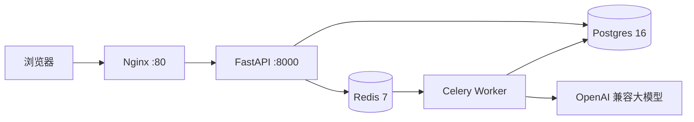

# AI 简历分析 + AI 模拟面试

面向求职者的简历智能分析与文字模拟面试工具，定位为个人学习与求职作品集项目。

## 当前功能

- 文本型 PDF 简历上传、解析、5MB/5页限制与 hash 去重
- AI 简历分析：岗位匹配、优势、短板、关键词缺口、改进建议、预测面试题
- 多轮文字模拟面试：SSE 流式回复、消息恢复、结束评价
- 用户注册/登录、JWT、用户数据隔离、历史记录
- Redis + Celery 异步任务基础

## 技术栈

- 后端：Python + FastAPI + PostgreSQL + SQLAlchemy / Alembic
- 前端：Vue 3 + Vite，生产环境由 Nginx 提供静态文件并反代 `/api`
- 异步：Redis 7 + Celery
- AI：国产大模型 OpenAI 兼容协议（当前 DeepSeek，可切换通义）

## 生产 Docker 一键启动

前置：安装 Docker Desktop，并准备一个真实的部署环境文件：

```bash
cp backend/.env.docker.example backend/.env.docker
# 编辑 backend/.env.docker，至少填写 POSTGRES_PASSWORD、JWT_SECRET_KEY、AI_API_KEY

docker compose -f docker-compose.prod.yml up -d --build
```

访问 `http://localhost`（或设置 `APP_PORT=8080` 后访问 `http://localhost:8080`）。

查看状态和日志：

```bash
docker compose -f docker-compose.prod.yml ps
docker compose -f docker-compose.prod.yml logs -f backend worker frontend
```

停止服务但保留数据：

```bash
docker compose -f docker-compose.prod.yml stop
```

数据卷：`pgdata`（Postgres）、`redisdata`（Redis）、`uploadsdata`（简历文件）。生产环境应定期备份 Postgres，并限制卷和 `.env.docker` 的文件权限。

## 架构



## 本地开发启动

```bash
# 根目录
bash .agents/skills/run-app/scripts/run-app.sh start
```

也可以按开发模式分别启动：

```bash
docker compose up -d db redis
cd backend
.venv\Scripts\python -m alembic upgrade head
.venv\Scripts\python -m uvicorn app.main:app --reload --port 8000
# 新窗口
cd frontend
npm install
npm run dev
```

本地页面：[http://localhost:5173](http://localhost:5173)

## 隐私与安全

- 简历只在用户主动上传/分析/面试时处理；AI 分析会把简历内容发送给第三方大模型服务。
- 简历原文件存储在应用数据卷，不由 Nginx 直接暴露；应用提供删除入口。
- 日志不打印简历正文、面试内容或 API Key。
- 真实 `.env`、`.env.docker`、API Key、JWT 密钥和演示账号密码不入 Git。
- 云服务器只开放 80/443；Postgres 5432 和 Redis 6379 不开放公网。启用 HTTPS 后设置 `JWT_SECURE_COOKIE=true`。

## 测试与检查

```bash
cd backend
.venv\Scripts\python -m pytest
.venv\Scripts\python -m ruff check .
cd ..\frontend
npm run build
```

## 项目文档

- `PROJECT-PLAN.md`：阶段计划、数据表和验收标准
- `AI-COLLABORATION.md`：人机协作约定
- `AGENTS.md`：技术与启动约定
- `PROGRESS.md`：进度日志


## 技术亮点（真实代码支撑 · v2.0）

### 架构与工程
- **Router → Service → Model 三层**：API 路由不堆业务逻辑，限流/记账/分析落库全下沉到 `services/`（`usage_service.py`、`analysis_service.py`），`RouterRegistry` 自动注册路由，`main.py` 仅保留两行注册调用
- **统一错误体系**：自定义异常类（`ValidationError` / `AuthenticationError` / `NotFoundError` / `RateLimitError`） + 全局 `exception_handler`，所有 4xx/5xx 输出 `{"code":"...","message":"...","details":null}`，成功响应保持原结构
- **Alembic 版本化迁移**：6 次迁移全线可用，禁止手改表；`created_at` 全表索引，`user_id` / `session_id` / `anonymous_id` 等关键查询字段均索引
- **Docker 五容器生产编排**：Nginx + FastAPI + Celery Worker + PostgreSQL + Redis，健康探针 + 依赖编排 + 具名卷持久化，`docker compose -f docker-compose.prod.yml up -d --build` 一键启动

### AI 与异步
- **AIService 统一封装**（`api_client.py`）：OpenAI 兼容协议，换模型 = 改 `.env` 三行；Pydantic 强校验 + 失败自动重试（最多 2 次），失败 ERROR 日志含模型/异常原文/重试次数
- **SSE 流式面试**：面试官回复逐字推送，三点跳动打字动画 + 头像气泡 UI
- **Celery + Redis 异步**：解析/AI 分析迁移到 Celery 任务，任务状态可查询；面试 SSE 保持同步流式
- **智能出题**：`position_type`（intern/fresh/senior/通用）按方向调整提示词难度与提问方向，PROMPT_VERSION 递增

### 安全与隐私
- **JWT HttpOnly Cookie + Argon2 密码哈希**：密码不落明文，JWT 不可读
- **用户数据隔离**：简历/分析/面试全量过滤 `user_id`，跨用户 404
- **简历软删除**（`deleted_at`）：删除后列表/详情 404，数据可审计，同文件可重新上传
- **上传三道防线**：扩展名 + magic bytes 双校验、文件名消毒、5MB/5页限制
- **日志不打印正文/Key**：日志系统按模块分级，AI 失败日志不含简历正文与 API Key
- **每日限流**：双轨（anonymous_id / user_id），基于 `usage_logs` 按日聚合，超限 429 含恢复时间

### 前端
- **手写 CSS 设计系统**（`main.css`）：零 UI 框架依赖，全局变量 + 通用类 + 动效，卡件入场动画、呼吸脉冲、打字动画
- **统一 fetch 封装**（`api.js`）：7 组件全收敛，自动 credentials + JSON 序列化 + 错误统一解析
- **只读管理面板**：首个注册用户自动 admin，统计卡片 + 用户列表 + 近 7 日用量

### 测试
- **33 个 pytest 全量覆盖**：上传校验、分析、面试（SSE/状态机）、认证、任务、隔离、软删除；全部 mock AI 不烧额度
- ruff 全绿、npm build 通过
