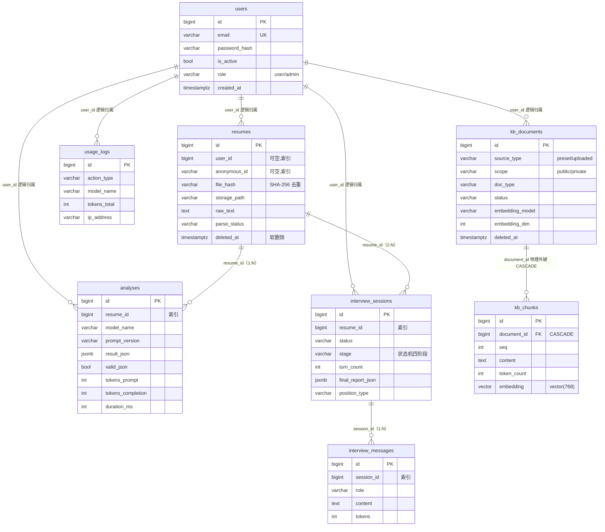

# 数据库表结构与查看指南

> 本文档说明项目数据库的连接信息、8 张业务表结构、索引/外键设计，以及自己查看数据库的三种方式。
> 字段与索引来自对运行中数据库的实时查询（2026-09-03），与 `backend/app/models/` 模型定义一致。
> 最后更新：2026-09-03

---

## 一、数据库基本信息

- **数据库**：PostgreSQL 16 + pgvector 0.8.6（向量扩展，基于 PG16 的镜像）
- **运行方式**：Docker Compose，容器名 `ai-interview-db`
- **数据持久化**：具名卷 `pgdata`，容器重建数据不丢

| 配置项 | 值 |
|---|---|
| 镜像 | `pgvector/pgvector:pg16` |
| 主机 Host | `localhost` |
| 端口 Port | `5432`（宿主机:容器） |
| 数据库名 Database | `ai_interview` |
| 用户名 Username | `ai` |
| 密码 Password | `ai`（本地开发账号，仅本机可见，生产用 `.env.docker`） |

共 **8 张业务表** + 1 张 `alembic_version`（Alembic 迁移版本表，自动管理，不用手动碰）。

## 二、表关系（ER 图）



> 关系说明：除 `kb_chunks.document_id → kb_documents.id` 是**物理外键（ON DELETE CASCADE）**外，其余 `resume_id / session_id / user_id` 都只建索引、不建外键约束，关联关系由应用层维护（为兼容软删除与匿名场景，项目有意为之）。

## 三、公共约定

- 每张表都有 `id`（**bigint 主键**）和 `created_at`（`timestamp with time zone`，默认 `now()`，带索引，列表/聚合按时间倒序）。
- 除 `users` 外，每张表都带**可空** `user_id`（bigint，索引）+ `anonymous_id`（varchar(64)，索引）：登录用户记 user_id，匿名用户记 anonymous_id，二者互斥；阶段4 接入登录后无缝切换。
- 约束命名走 `NAMING_CONVENTION`（如 `pk_表名`、`ix_表名_列名`、`fk_...`），让 Alembic 生成的约束名可预测。

## 四、各表字段明细

### 1. users — 用户账户

| 列 | 类型 | 可空 | 说明 |
|---|---|---|---|
| id | bigint | 否 | 主键 |
| email | varchar(255) | 否 | 登录邮箱，**唯一索引** `ix_users_email` |
| password_hash | varchar(255) | 否 | Argon2 哈希，不存明文 |
| is_active | boolean | 否 | 是否启用，默认 true |
| role | varchar(20) | 否 | `user` / `admin`，默认 user（首个注册用户自动 admin） |
| created_at | timestamptz | 否 | 索引 |

### 2. resumes — 简历（一次上传一行）

| 列 | 类型 | 可空 | 说明 |
|---|---|---|---|
| id | bigint | 否 | 主键 |
| user_id | bigint | 是 | 归属，索引 |
| anonymous_id | varchar(64) | 是 | 匿名标识，索引 |
| filename | varchar(255) | 否 | 消毒后的原始文件名 |
| file_hash | varchar(64) | 否 | SHA-256，重复上传去重，索引 |
| storage_path | varchar(500) | 否 | 原文件路径，存 Web 根目录之外 |
| raw_text | text | 是 | 解析出的纯文本 |
| page_count | int | 是 | 页数（限 5 页） |
| file_size | int | 是 | 字节数（限 5MB） |
| parse_status | varchar(20) | 否 | `pending / success / failed / unsupported` |
| parse_error | text | 是 | 面向用户的失败话术 |
| deleted_at | timestamptz | 是 | 软删除时间，非空即已删 |
| created_at | timestamptz | 否 | 索引 |

### 3. analyses — AI 分析结果（原始返回留档）

| 列 | 类型 | 可空 | 说明 |
|---|---|---|---|
| id | bigint | 否 | 主键 |
| resume_id | bigint | 否 | 逻辑关联 resumes，索引 |
| user_id / anonymous_id | bigint / varchar(64) | 是 | 归属索引 |
| model_name | varchar(100) | 否 | 使用的模型 |
| prompt_version | varchar(20) | 否 | 提示词版本，改提示词递增 |
| result_json | **jsonb** | 否 | AI 原始返回（六块报告）留档 |
| valid_json | boolean | 是 | 输出校验是否通过 |
| tokens_prompt | int | 是 | 输入 token |
| tokens_completion | int | 是 | 输出 token |
| duration_ms | int | 是 | 调用耗时毫秒 |
| created_at | timestamptz | 否 | 索引 |

### 4. interview_sessions — 面试场次

| 列 | 类型 | 可空 | 说明 |
|---|---|---|---|
| id | bigint | 否 | 主键 |
| resume_id | bigint | 否 | 基于哪份简历，索引 |
| user_id / anonymous_id | | 是 | 归属索引 |
| status | varchar(20) | 否 | `in_progress / finished / abandoned` |
| stage | varchar(20) | 否 | 状态机 `intro/technical/deep_dive/wrapup`，默认 intro |
| turn_count | int | 否 | 当前轮次，设上限防无限聊 |
| final_report_json | **jsonb** | 是 | 结束分维度评价报告 |
| position_type | varchar(20) | 是 | `intern/fresh/senior`，可空=通用 |
| created_at | timestamptz | 否 | 索引 |

### 5. interview_messages — 面试消息（逐条落库，刷新可恢复）

| 列 | 类型 | 可空 | 说明 |
|---|---|---|---|
| id | bigint | 否 | 主键 |
| session_id | bigint | 否 | 逻辑关联 interview_sessions，索引 |
| role | varchar(20) | 否 | `interviewer / candidate / system` |
| content | text | 否 | 消息正文 |
| tokens | int | 是 | 该条 token 数 |
| created_at | timestamptz | 否 | 索引 |

### 6. kb_documents — 知识库文档（v3.0）

| 列 | 类型 | 可空 | 说明 |
|---|---|---|---|
| id | bigint | 否 | 主键 |
| user_id / anonymous_id | | 是 | owner 隔离索引 |
| title | varchar(255) | 否 | 文档标题 |
| source_type | varchar(20) | 否 | `preset`（预置）/ `uploaded`（上传） |
| scope | varchar(20) | 否 | `public`（全站可见）/ `private`（仅本人） |
| doc_type | varchar(20) | 否 | `text / markdown / pdf` |
| file_hash | varchar(64) | 是 | 上传去重，索引 |
| raw_text | text | 是 | 文档原文 |
| status | varchar(20) | 否 | `pending/processing/ready/failed` |
| parse_error | text | 是 | 失败原因 |
| embedding_model | varchar(100) | 是 | 向量化所用模型 |
| embedding_dim | int | 是 | 向量维度，维度不符置 failed 的护栏 |
| deleted_at | timestamptz | 是 | 软删除 |
| created_at | timestamptz | 否 | 索引 |

### 7. kb_chunks — 知识库切块向量（v3.0 核心 RAG 表）

| 列 | 类型 | 可空 | 说明 |
|---|---|---|---|
| id | bigint | 否 | 主键 |
| document_id | bigint | 否 | **物理外键 → kb_documents.id，ON DELETE CASCADE**，索引 |
| seq | int | 否 | 文档内块序号，回答引用来源定位 |
| content | text | 否 | 切块正文（约 600 字/块 + 60 字重叠） |
| token_count | int | 是 | 近似 token 数 |
| embedding | **vector(768)** | 否 | pgvector 向量，绑定 nomic-embed-text |
| created_at | timestamptz | 否 | 索引 |

### 8. usage_logs — 用量与限流（每次耗资源动作记一笔）

| 列 | 类型 | 可空 | 说明 |
|---|---|---|---|
| id | bigint | 否 | 主键 |
| user_id / anonymous_id | | 是 | 双轨限流索引 |
| action_type | varchar(30) | 否 | `parse / analysis / interview_message` |
| model_name | varchar(100) | 是 | 模型 |
| tokens_total | int | 是 | 本次消耗 token |
| ip_address | varchar(64) | 是 | 来源 IP |
| created_at | timestamptz | 否 | 索引，每日限流按此日期聚合 |

## 五、索引设计要点

- **主键**：每表 `pk_表名`（btree，id）。
- **高频查询字段全部建 btree 索引**：`user_id / anonymous_id / resume_id / session_id / document_id / file_hash / created_at`。
- **唯一索引**：`ix_users_email`（email 唯一）、`alembic_version_pkc`（版本号唯一）。
- **向量索引（重点）**：

  ```sql
  CREATE INDEX ix_kb_chunks_embedding_hnsw
  ON public.kb_chunks
  USING hnsw (embedding vector_cosine_ops);  -- 余弦相似度，HNSW 近似最近邻
  ```

- 768 维与 nomic-embed-text 模型绑定，**换 embedding 维度必须新建迁移 + 全部重新入库**（`Vector(768)` 写死在迁移里）。

## 六、当前本地数据量（2026-09-03 实时）

| 表 | 行数 | 表 | 行数 |
|---|---|---|---|
| users | 63 | interview_messages | 5 |
| resumes | 1 | usage_logs | 5 |
| analyses | 1 | kb_documents | 6 |
| interview_sessions | 1 | kb_chunks | 83 |

## 七、自己怎么查看

> 前提：Docker Desktop 在运行、`ai-interview-db` 容器 Up（`docker ps` 能看到 healthy）。容器停了就在项目根目录执行 `docker compose up -d db` 拉起，数据在具名卷里不会丢。

### 方式 1：命令行 psql（最快，零安装，推荐）

进入交互式控制台（在 PowerShell / Windows Terminal / VSCode 终端执行）：

```powershell
docker exec -it ai-interview-db psql -U ai -d ai_interview
```

成功后提示符变为 `ai_interview=#`，常用**元命令**（以反斜杠开头）：

| 元命令 | 作用 |
|---|---|
| `\dt` | 列出全部表 |
| `\d resumes` | 看单表完整结构（列/类型/索引/外键） |
| `\d kb_chunks` | 看向量表（含 vector(768) 与 HNSW 索引） |
| `\di` | 列出所有索引 |
| `\du` | 列出数据库用户/角色 |
| `\x` | 切换纵向展开显示（列多时好用，再敲一次切回） |
| `\q` | 退出 psql |

进去后可直接写 SQL：

```sql
SELECT count(*) FROM kb_chunks;
SELECT id, email, role FROM users LIMIT 5;
SELECT id, title, scope, status FROM kb_documents;
```

不进交互、一条命令查完即走（去掉 `-it`，加 `-c`）：

```powershell
docker exec ai-interview-db psql -U ai -d ai_interview -c "\dt"
docker exec ai-interview-db psql -U ai -d ai_interview -c "\d kb_chunks"
```

> `-it` 是交互式参数，必须在你自己的真实终端窗口里运行。

### 方式 2：图形化工具（最直观，适合长期用）

**DBeaver Community（免费）**：新建连接 → 选 PostgreSQL → 填第一节的连接参数（localhost / 5432 / ai_interview / ai / ai）→ 测试连接（首次同意下载 PG 驱动）→ 左侧展开 `ai_interview → Schemas → public → Tables`，可看列、索引、外键，右键「查看数据」浏览行。

**VSCode 插件**：装 `Database Client`（cweijan）或 `SQLTools` + PostgreSQL 驱动，新建 PG 连接填同一套参数，不用切窗口。

> `embedding` 是 pgvector 的 `vector(768)` 自定义类型，工具能看到列和 HNSW 索引，但向量值是 768 个浮点数，一般不肉眼查看。

### 方式 3：直接读源码（表结构的权威定义来源）

- 模型定义：`backend/app/models/`（base / user / resume / analysis / interview / usage_log / kb），字段类型、索引、注释与数据库一一对应。
- 建表与每次变更历史：`backend/alembic/versions/` 迁移脚本（含 HNSW 索引创建语句）。
- 最初设计稿：`PROJECT-PLAN.md` 第 2 节。

## 八、改动表结构的正确姿势（项目铁律）

**禁止手动 `CREATE/ALTER TABLE` 改库**，一律走 Alembic 迁移，在 `backend/` 目录执行：

```powershell
# 1. 改 backend/app/models/ 下的模型
# 2. 自动生成迁移脚本
.\.venv\Scripts\python -m alembic revision --autogenerate -m "说明改了什么"
# 3. 应用迁移到数据库
.\.venv\Scripts\python -m alembic upgrade head
```

注意经典坑：`alembic/env.py` 必须 import 全部模型，否则 autogenerate 会**静默生成空迁移**；应用后要实际进库确认表/列真的变了。
