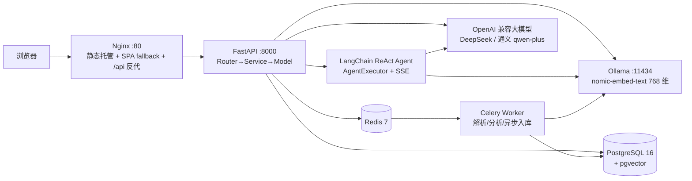

# 技术栈与功能点

> 本文档汇总「AI 简历分析 + AI 模拟面试」项目用到的全部技术栈与功能模块，供学习回顾与作品集展示。
> 最后更新：2026-09-14 · 对应版本 v3.5（混合检索提优 + Agent 多工具 + 复盘雷达图 + 分析版本对比）

---

## 一、项目定位

上传简历 → AI 生成结构化分析报告 → 基于简历开展多轮文字模拟面试并给出结束评价；v3.0 起叠加基于向量检索的知识库问答，v3.1 升级为多会话在线对话，v3.4 引入 LangChain ReAct Agent 做 AI 客服。个人学习 + 求职作品集项目。

## 二、整体架构

本地开发时不经过 Nginx：Vite（5173）通过代理把 `/api` 转发到 FastAPI（8000），天然同源、无 CORS。

## 三、技术栈清单

### 1. 后端

| 技术 | 版本/说明 | 用途 |
|---|---|---|
| Python | 3.13 | 运行时 |
| FastAPI | — | Web 框架，业务路由统一挂 `/api` 前缀（`/health` 例外） |
| SQLAlchemy | 2.x | ORM，`Mapped` / `mapped_column` 类型注解写法 |
| Alembic | — | 数据库版本化迁移，**改表必须走迁移，禁止手改表** |
| Pydantic / pydantic-settings | — | 请求/响应强校验、从 `backend/.env` 读配置 |
| Celery | — | 异步任务（简历解析、AI 分析、知识库入库） |
| Redis | 7 | Celery broker，appendonly 持久化 |
| JWT | HttpOnly Cookie | 无状态登录凭证，前端 JS 不可读 |
| Argon2 | — | 密码哈希存储，不存明文 |
| SSE | Server-Sent Events | 面试、RAG 问答、AI 客服三处逐字流式输出 |
| LangChain | 0.3 稳定线（`>=0.3,<0.4`） | v3.4 AI 客服 Agent 层（`services/agent/`）：ReAct + AgentExecutor（0.3 专属，1.x 已移除并改走 langgraph，故封顶） |
| langchain-openai | 0.3 线 | `ChatOpenAI` 走 OpenAI 兼容协议，通义 / DeepSeek 均可驱动 Agent |
| jieba | 0.42 | 中文分词（v3.5 混合检索的词法路），纯 Python 无系统依赖 |

**架构模式**

- 三层分层：`Router（路由）→ Service（业务）→ Model（数据）`，API 路由不堆业务逻辑。
- `RouterRegistry` 自动注册路由，`main.py` 只保留两行注册调用。
- 统一错误体系：自定义异常（`ValidationError / AuthenticationError / NotFoundError / RateLimitError`）+ 全局异常处理器，所有 4xx/5xx 输出统一结构 `{code, message, details}`。
- 分级日志系统：连接池、慢查询截断、abandoned 连接回收；日志不打印简历正文、面试内容与 API Key。

### 2. 数据库与向量检索

| 技术 | 版本/说明 | 用途 |
|---|---|---|
| PostgreSQL | 16 | 主数据库，Docker 容器 `ai-interview-db` |
| pgvector | 0.8.6 | Postgres 向量扩展，存储 embedding |
| 向量索引 | HNSW + 余弦距离 | `kb_chunks.embedding vector(768)` 近似最近邻检索 |
| Redis | 7-alpine | 容器 `ai-interview-redis`，Celery broker |

### 3. AI 能力

| 技术 | 说明 |
|---|---|
| OpenAI 兼容协议 | `AIService` 统一封装，换模型 = 改 `.env` 的 `AI_BASE_URL / AI_MODEL / AI_API_KEY` 三行 |
| 当前模型 | 通义 qwen-plus（曾用 DeepSeek deepseek-chat 做对比验证） |
| 输出治理 | 固定 JSON 结构 + Pydantic 校验 + 失败自动重试（最多 2 次） |
| 版本追溯 | 提示词带 `PROMPT_VERSION`，改提示词必须递增，旧报告不复用 |
| 本地 Embedding | Ollama 跑 `nomic-embed-text`，768 维，OpenAI 兼容 API；切云端只改配置 |
| RAG 链路 | 混合检索（向量 + 词法 BM25，RRF 融合）→ 取 top-k → 大模型生成 + 引用来源；相似度高阈值过滤，相关阈值 0.65 |
| Agent 框架 | LangChain 0.3 ReAct（`create_openai_tools_agent` + `AgentExecutor`），单次最大 6 步工具循环（`agent_max_iterations`） |
| Agent 流式 | 后台 daemon 线程跑 `AgentExecutor`，自定义 Callback 把 `on_tool_start / on_tool_end / on_llm_new_token` 转成 action / observation / delta 事件队列，API 层转 SSE |
| Agent 工具工厂 | `make_tools(db, user_id, anonymous_id, ctx)` **每请求闭包工厂**：工具实例绑定本次请求的 db 会话与归属者，杜绝多请求共享导致串数据 |
| Agent 事件协议 | `meta → (action → observation)* → delta* → done{content, iterations, tokens, citations, message_id}`，异常走 `error` |

### 4. 前端

| 技术 | 版本/说明 | 用途 |
|---|---|---|
| Vue | 3.5 | Composition API + `<script setup>` |
| Vite | 7 | 开发服务器与构建工具 |
| JavaScript | 原生 | 不使用 TypeScript（仅 `vite.config.ts` 例外），不引入 vue-router / Pinia |
| 设计系统 | 手写 `main.css` | 青绿（emerald）风，零 UI 框架依赖，CSS 变量 + 通用类 + 动效 |
| HTTP 层 | 手写 `api.js` | 统一封装 get/post/del 与 SSE，自动 `credentials: include`、统一错误解析 |
| KeepAlive | Vue 内建 | 各视图组件切换时保活，聊天/列表状态不丢 |
| 组件复用 | props 驱动 | v3.4：`AgentChatCore` 被整页视图 `AgentChatView` 与右下角浮层 `AgentWidget` 复用（`compact` 切换密度） |
| 数据可视化 | 纯 CSS / 手写 SVG | 零图表库：用量柱状图（CSS 渐变）+ 日期范围选择器（6×7 日历网格）+ 面试评分雷达图 |

### 5. 部署与运维

| 技术 | 说明 |
|---|---|
| Docker / Docker Compose | 开发与生产统一容器化 |
| 生产六容器 | Nginx + FastAPI + Celery Worker + PostgreSQL(pgvector) + Redis + Ollama |
| Nginx | 静态文件托管、SPA history fallback、`/api` 反向代理、`proxy_buffering off` 保证 SSE 不缓冲 |
| 具名卷持久化 | `pgdata`（数据库）、`redisdata`、`uploadsdata`（简历原文件）、`ollama_data`（模型） |
| 健康/就绪探针 | Postgres `pg_isready`、Redis `ping`、Ollama `ollama list`，后端 `/health` |
| 生产启动 | `docker compose -f docker-compose.prod.yml up -d --build` 一键起全套 |

### 6. 质量与工程化

| 工具/机制 | 说明 |
|---|---|
| pytest | 143 个用例，AI/embedding 全部 mock，不烧真实调用额度 |
| 测试护栏 | `conftest.py` 校验 `DATABASE_URL` host，非本地直接终止，防误清远程库 |
| ruff | lint + format，提交前全绿 |
| 固定测试简历集 | `test-resumes/` 5 份 PDF，改解析/提示词后必须回归对比 |
| RAG 评测 | `scripts/eval_rag.py` + 49 题黄金问答集，并排对比纯向量 / 混合，改检索必跑（见模块 10） |
| Git | Conventional Commits（feat/fix/docs/refactor…）+ 版本 tag（v0.1 ~ v3.4）；已推 GitHub |

**本机开发环境**：Python 3.13.9、Node.js 24.12.0、Docker Desktop（含 Compose）、Git 2.52；Windows + PowerShell。

## 四、功能点清单

### 模块 1 · 简历上传与解析

- 文本型 PDF 上传，三道防线校验：扩展名 + 文件头 magic bytes（`%PDF-`）+ 5MB / 5 页限制。
- 文件名消毒；SHA-256 `file_hash` 重复上传去重，不重复解析计费。
- 非 PDF / 超限 / 扫描件分别给明确友好话术；解析状态 `pending / success / failed / unsupported`。
- 简历软删除（`deleted_at`）：删除后列表/详情 404，数据可审计，同文件可重新上传。
- 原文件存储在 Web 根目录之外，不提供目录遍历。

### 模块 2 · AI 简历分析

- 六块结构化报告：岗位匹配、优势、短板、关键词缺口、改进建议、预测面试题。
- 固定 JSON 输出结构 + 校验 + 失败自动重试（最多 2 次），失败给友好提示而非白屏。
- 同一简历分析结果缓存去重；AI 重试失败写「墓碑」标记。
- 每次调用写 `usage_logs`，token 消耗（prompt/completion）与耗时可见。
- 提示词版本号入库，支持历史输出对比。
- **多版本报告对比（v3.5）**：`GET /api/resumes/{id}/analyses` 返回该简历全部历史分析（**不过滤 prompt_version**，只保留 `valid_json=true`，最多 10 版）；报告页可选任意一版并排对比，逐条标出「仅本版有」的差异条目。

### 模块 3 · 文字模拟面试

- 四阶段状态机：`intro → technical → deep_dive → wrapup`。
- SSE 逐字流式回复，前端三点跳动打字动画。
- 面试消息逐条落库，中途刷新页面可恢复会话（数据结构天然兼容未来语音）。
- 最大轮次限制，防止无限对话；达到上限或主动结束生成分维度结束评价报告。
- 智能出题：`position_type`（intern 实习 / fresh 校招 / senior 社招 / 通用）调整难度与提问方向。
- 场次状态 `in_progress / finished / abandoned`。
- **复盘雷达图（v3.5）**：结束评价的四维度（技术深度/表达结构/项目真实性/整体表现）用纯手写 SVG 雷达图呈现；`GET /api/interviews/scores` 返回本人已完成场次的评分列表，可在图上叠加任意一场做对比（虚线灰多边形 + 图例）。

### 模块 4 · 用户体系与权限

- 注册 / 登录 / 登出；Argon2 密码哈希 + JWT HttpOnly Cookie。
- 用户数据完全隔离：简历/分析/面试全部按 `user_id` 过滤，跨用户访问返回 404。
- 登录失败次数锁定（防爆破，超限返回 429 与解锁时间）。
- 历史记录页：汇总当前用户的简历 / 分析 / 面试。
- 首个注册用户自动成为 admin；只读管理面板：统计卡片 + 用户列表 + 近 7 日用量。

### 模块 5 · 知识库问答与在线对话（v3.0 → v3.1）

- 段落切块器：约 600 字/块 + 60 字重叠，超长段落硬切，保证无内容丢失。
- **混合检索（v3.5）**：pgvector HNSW 余弦相似度（向量路，数据库排序）+ jieba 分词 BM25（词法路，手写实现，无第三方 BM25 依赖）→ RRF 融合取 top-k。参数 `kb_hybrid_candidates=50`（每路候选）、`kb_rrf_k=5`（在 49 题评测集上扫描选定）；`kb_hybrid_enabled=False` 可一键退回纯向量路径做 A/B。详见模块 10。
- RAG 流式回答并附引用来源（前端可折叠展开）；未命中时明确提示「知识库无相关内容」。
- 知识库文档 CRUD：支持上传 txt / md / pdf。
- Celery 异步入库：文档状态 `pending → processing → ready`，任务幂等可重试。
- 预置语料：7 个主题文件（Java / 数据库 / 系统设计 / 网络 / 算法 / 岗位 JD / AI 应用开发）。
- owner 隔离：预置 `scope=public` 全站可见，用户上传 `scope=private` 仅本人可见。
- embedding 维度不符置 failed 护栏；知识库每日上传上限。
- **多会话管理（v3.1）**：`chat_sessions / chat_messages` 两表；会话列表按 `updated_at` 倒序、支持新建/切换/软删除；首条提问时把默认标题「新对话」自动更新为提问内容前 20 字。
- **消息持久化（v3.1）**：流式开始前存用户消息、流式结束后存 assistant 消息（含 `citations` 与 `tokens`）并刷新会话活跃时间；保存失败只记日志，不影响已返回内容。
- 黄金问答集评测：49 题，`scripts/eval_rag.py` 可复跑（当前基线见模块 10）。

### 模块 6 · AI 客服 Agent（v3.4 → v3.5）

- **LangChain 0.3 ReAct Agent**：`create_openai_tools_agent` + `AgentExecutor`，单次最大 6 步工具循环，防无限调用。
- **SSE 全程流式**：事件序 `meta → (action → observation)* → delta* → done`；工具调用过程对用户可见（前端「工具调用过程」可折叠区）。
- **工具工厂（v3.5 扩到四件套）**：`make_tools(db, user_id, anonymous_id, ctx)` 每请求创建闭包工具，绑定本次请求的 db 会话与归属者；四个工具分别是 `kb_search`（知识库检索，唯一回填 citations 的）/ `resume_lookup`（本人简历，可按关键词在正文里定位片段）/ `interview_history`（本人面试场次与分维度评分）/ `usage_stats`（本人近 N 天各动作次数与 token）；个人数据工具一律按归属者过滤，识别不到身份时明确拒绝而非返回空结果。
- **工具容错**：工具内部吞掉检索类异常返回自然语言说明，让 Agent 换通用知识兜底。
- **引用回填**：工具命中的知识库块经 `ToolContext` 收集，随 `done` 事件回传前端展示来源。
- **过程留档**：工具调用过程写入 `chat_messages.tool_steps`（JSONB），刷新后可回看。
- **两形态复用**：用户端整页视图 `AgentChatView` + 管理端右下角 56px 气泡浮层 `AgentWidget`，共用 `AgentChatCore` 内核。
- **会话隔离**：与在线对话共用 `chat_sessions / chat_messages`，靠 `session_type='agent'` 区分——两类会话互不出现在对方列表。
- **独立限流**：`agent` / `agent_create` 两路记账，每日上限 30 次（Agent 单次可能多轮调 LLM，故低于在线对话）。
- **未配 Key 快速失败**：`llm_factory` 抛 `ValueError` → API 返回 503 明确话术，不进入流式。

### 模块 7 · 数据看板 / 使用日志 / 语料库管理（管理端，v3.1~v3.3）

- **数据看板（v3.2）**：五统计卡片等宽一行（用户 / 简历 / 分析 / 面试 / 今日 Token，悬浮抬升 + 边框变主题色）；用户列表卡片化（表头 sticky + 前端分页 10 条/页 + 页码省略号折叠）；近 7 日用量左右分栏（表格 + 纯 CSS 渐变柱状图，柱图不受分页影响）。
- **使用日志（v3.3）**：`GET /api/usage/logs` 只返回当前用户自己的明细（未登录 401、匿名日志不展示）；支持动作类型精确、模型 ILIKE 模糊、IP 精确、日期范围（含当天 00:00:00~23:59:59）四类筛选；排序 `created_at DESC, id DESC`；后端分页 `page/page_size`（上限 50）。
- **日期范围选择器（v3.3）**：`DateRangePicker.vue` 纯手写零依赖——月份切换 + 周一起始 6×7 网格 + 时间输入 + 点击外部关闭，另有「今日 / 7 天 / 30 天」快捷按钮。
- **语料库管理（v3.1）**：管理端可列出全部文档（含预置与所有用户上传，带所有者邮箱与块数），可删除任意文档（含预置，二次确认，软删除可审计）；上传直接入预置 `public` 语料，全局 `file_hash` 去重、pdf 上限 50 页。
- **权限**：`_admin_only` 统一判定——未登录 401、普通用户 403。

### 模块 8 · 系统横切能力

- **双轨限流**：匿名按 `anonymous_id`、登录按 `user_id`，基于 `usage_logs` 按日聚合，超限返回 429 与恢复时间。
- **统一错误体系**：自定义异常 + 全局 handler，错误结构统一。
- **三层架构 + 服务层下沉**：限流、记账、分析落库全部收敛到 `services/`。
- **异步任务化**：解析 / 分析 / 知识库入库走 Celery + Redis，任务状态可查；面试 SSE 保持同步流式。
- **安全**：API Key 只放 `backend/.env` 且永不入库；日志不打印正文与 Key；简历隐私提示与删除入口。

### 模块 9 · 前端界面

- 三段式布局：吸顶毛玻璃顶栏（SVG 对话气泡 logo + 头像下拉/登录按钮）+ 可折叠侧边栏 + 内容区。
- 可折叠侧边栏：224px ↔ 64px 图标条，宽度过渡动画，当前项青绿高亮。
- **双端导航分离（v3.4）**：管理端（`role=admin`）五项——首页 / 在线对话 / 使用日志 / 数据看板 / 语料库管理，并挂右下角 AI 客服悬浮气泡；普通与匿名用户三项——首页 / AI 客服（整页） / 个人中心（需登录）。
- 视图 KeepAlive 保活切换；`agent`、`profile` 走 `.page.wide` 宽版容器。
- 登录居中模态（遮罩点击 / ✕ 关闭，登录成功自动关闭并刷新列表）；头像下拉含邮箱、角色徽章、退出。
- 权限交互：未登录点击受限项弹出登录模态而非切视图；退出后回首页、导航集合按角色收敛。
- 视觉动效：卡片入场、呼吸脉冲、打字动画、拖拽上传区、头像气泡。
- 窄屏兜底：窗口 ≤900px 侧边栏自动收缩为纯图标条（非完整移动端适配）。

### 模块 10 · 检索质量与评测（v3.5）

- **评测脚本**：`scripts/eval_rag.py` 对 49 题黄金问答集（`data/kb_eval/qa.json`）**并排跑两种模式**——`vector`（纯向量，v3.0 基线）/ `hybrid`（向量 + BM25 RRF，生产路径），输出汇总对比、**翻转明细**（哪些题被救回/变差）与逐题明细，写入 `data/kb_eval/report.md`。
- **当前基线**（2026-09-14，语料 7 文件 111 块）：

  | 指标 | vector | hybrid | 变化 |
  |---|---|---|---|
  | hit@1 | 35/49 (71.4%) | **43/49 (87.8%)** | +8 |
  | hit@5 | 45/49 (91.8%) | **49/49 (100%)** | +4 |

- **典型救回场景**：术语类中文短查询（「垃圾回收算法」「类的加载过程」「线程池核心参数」）——纯向量把人名/岗位 JD 排在前面，BM25 靠字面命中把它们拉回正确来源，且**无任何一题变差**。
- **参数扫描方法**：在评测集上扫 RRF `k ∈ {5,10,20,30,60}` × 候选池 `{20,50}`，实测 k=5 / 50 最优（k=60 时 41/49）——中文短查询的头部名次含金量高于英文长文场景。
- **回归纪律**：改切块 / embedding / 检索逻辑后必须重跑本脚本对比基线；`kb_hybrid_enabled=False` 可随时退回纯向量口径复现旧数据。

## 五、明确不做（范围边界）

- 暗色模式（已砍）、vue-router / Pinia（不引入）、完整移动端适配。
- 语音面试（远期扩展，消息表结构已预留兼容）。
- docx / 图片简历与 OCR、国际化、支付 / 配额 / 可写管理后台。
