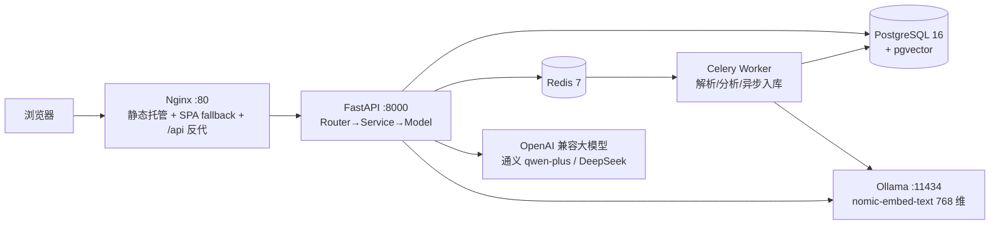

# 技术栈与功能点

> 本文档汇总「AI 简历分析 + AI 模拟面试」项目用到的全部技术栈与功能模块，供学习回顾与作品集展示。
> 最后更新：2026-09-03 · 对应版本 v3.0（Playground 知识库问答封版 + 前端布局重构）

---

## 一、项目定位

上传简历 → AI 生成结构化分析报告 → 基于简历开展多轮文字模拟面试并给出结束评价；v3.0 新增基于向量检索的知识库问答（Playground）。个人学习 + 求职作品集项目。

## 二、整体架构

本地开发时不经过 Nginx：Vite（5173）通过代理把 `/api` 转发到 FastAPI（8000），天然同源、无 CORS。

## 三、技术栈清单

### 1. 后端

| 技术 | 版本/说明 | 用途 |
|---|---|---|
| Python | 3.13 | 运行时 |
| FastAPI | — | Web 框架，业务路由统一挂 `/api` 前缀（`/health` 例外） |
| SQLAlchemy | 2.x | ORM，`Mapped` / `mapped_column` 类型注解写法 |
| Alembic | — | 数据库版本化迁移，**改表必须走迁移，禁止手改表** |
| Pydantic / pydantic-settings | — | 请求/响应强校验、从 `backend/.env` 读配置 |
| Celery | — | 异步任务（简历解析、AI 分析、知识库入库） |
| Redis | 7 | Celery broker，appendonly 持久化 |
| JWT | HttpOnly Cookie | 无状态登录凭证，前端 JS 不可读 |
| Argon2 | — | 密码哈希存储，不存明文 |
| SSE | Server-Sent Events | 面试与 RAG 回答逐字流式输出 |

**架构模式**

- 三层分层：`Router（路由）→ Service（业务）→ Model（数据）`，API 路由不堆业务逻辑。
- `RouterRegistry` 自动注册路由，`main.py` 只保留两行注册调用。
- 统一错误体系：自定义异常（`ValidationError / AuthenticationError / NotFoundError / RateLimitError`）+ 全局异常处理器，所有 4xx/5xx 输出统一结构 `{code, message, details}`。
- 分级日志系统：连接池、慢查询截断、abandoned 连接回收；日志不打印简历正文、面试内容与 API Key。

### 2. 数据库与向量检索

| 技术 | 版本/说明 | 用途 |
|---|---|---|
| PostgreSQL | 16 | 主数据库，Docker 容器 `ai-interview-db` |
| pgvector | 0.8.6 | Postgres 向量扩展，存储 embedding |
| 向量索引 | HNSW + 余弦距离 | `kb_chunks.embedding vector(768)` 近似最近邻检索 |
| Redis | 7-alpine | 容器 `ai-interview-redis`，Celery broker |

### 3. AI 能力

| 技术 | 说明 |
|---|---|
| OpenAI 兼容协议 | `AIService` 统一封装，换模型 = 改 `.env` 的 `AI_BASE_URL / AI_MODEL / AI_API_KEY` 三行 |
| 当前模型 | 通义 qwen-plus（曾用 DeepSeek deepseek-chat 做对比验证） |
| 输出治理 | 固定 JSON 结构 + Pydantic 校验 + 失败自动重试（最多 2 次） |
| 版本追溯 | 提示词带 `PROMPT_VERSION`，改提示词必须递增，旧报告不复用 |
| 本地 Embedding | Ollama 跑 `nomic-embed-text`，768 维，OpenAI 兼容 API；切云端只改配置 |
| RAG 链路 | 段落切块（约 600 字/块 + 60 字重叠）→ 向量化入库 → HNSW 余弦检索（阈值 0.65）→ 大模型生成 + 引用来源 |

### 4. 前端

| 技术 | 版本/说明 | 用途 |
|---|---|---|
| Vue | 3.5 | Composition API + `<script setup>` |
| Vite | 7 | 开发服务器与构建工具 |
| JavaScript | 原生 | 不使用 TypeScript（仅 `vite.config.ts` 例外），不引入 vue-router / Pinia |
| 设计系统 | 手写 `main.css` | 青绿（emerald）风，零 UI 框架依赖，CSS 变量 + 通用类 + 动效 |
| HTTP 层 | 手写 `api.js` | 统一封装 get/post/del 与 SSE，自动 `credentials: include`、统一错误解析 |
| KeepAlive | Vue 内建 | 四个视图组件切换时保活，聊天/列表状态不丢 |

### 5. 部署与运维

| 技术 | 说明 |
|---|---|
| Docker / Docker Compose | 开发与生产统一容器化 |
| 生产六容器 | Nginx + FastAPI + Celery Worker + PostgreSQL(pgvector) + Redis + Ollama |
| Nginx | 静态文件托管、SPA history fallback、`/api` 反向代理、`proxy_buffering off` 保证 SSE 不缓冲 |
| 具名卷持久化 | `pgdata`（数据库）、`redisdata`、`uploadsdata`（简历原文件）、`ollama_data`（模型） |
| 健康/就绪探针 | Postgres `pg_isready`、Redis `ping`、Ollama `ollama list`，后端 `/health` |
| 生产启动 | `docker compose -f docker-compose.prod.yml up -d --build` 一键起全套 |

### 6. 质量与工程化

| 工具/机制 | 说明 |
|---|---|
| pytest | 55 个用例，AI/embedding 全部 mock，不烧真实调用额度 |
| 测试护栏 | `conftest.py` 校验 `DATABASE_URL` host，非本地直接终止，防误清远程库 |
| ruff | lint + format，提交前全绿 |
| 固定测试简历集 | `test-resumes/` 5 份 PDF，改解析/提示词后必须回归对比 |
| RAG 评测 | `scripts/eval_rag.py` + 49 题黄金问答集，基线 hit@1 73.5% / hit@5 93.9% |
| Git | Conventional Commits（feat/fix/docs/refactor…）+ 每阶段 tag；当前仅本地，未推远端 |

**本机开发环境**：Python 3.13.9、Node.js 24.12.0、Docker Desktop（含 Compose）、Git 2.52；Windows + PowerShell。

## 四、功能点清单

### 模块 1 · 简历上传与解析

- 文本型 PDF 上传，三道防线校验：扩展名 + 文件头 magic bytes（`%PDF-`）+ 5MB / 5 页限制。
- 文件名消毒；SHA-256 `file_hash` 重复上传去重，不重复解析计费。
- 非 PDF / 超限 / 扫描件分别给明确友好话术；解析状态 `pending / success / failed / unsupported`。
- 简历软删除（`deleted_at`）：删除后列表/详情 404，数据可审计，同文件可重新上传。
- 原文件存储在 Web 根目录之外，不提供目录遍历。

### 模块 2 · AI 简历分析

- 六块结构化报告：岗位匹配、优势、短板、关键词缺口、改进建议、预测面试题。
- 固定 JSON 输出结构 + 校验 + 失败自动重试（最多 2 次），失败给友好提示而非白屏。
- 同一简历分析结果缓存去重；AI 重试失败写「墓碑」标记。
- 每次调用写 `usage_logs`，token 消耗（prompt/completion）与耗时可见。
- 提示词版本号入库，支持历史输出对比。

### 模块 3 · 文字模拟面试

- 四阶段状态机：`intro → technical → deep_dive → wrapup`。
- SSE 逐字流式回复，前端三点跳动打字动画。
- 面试消息逐条落库，中途刷新页面可恢复会话（数据结构天然兼容未来语音）。
- 最大轮次限制，防止无限对话；达到上限或主动结束生成分维度结束评价报告。
- 智能出题：`position_type`（intern 实习 / fresh 校招 / senior 社招 / 通用）调整难度与提问方向。
- 场次状态 `in_progress / finished / abandoned`。

### 模块 4 · 用户体系与权限

- 注册 / 登录 / 登出；Argon2 密码哈希 + JWT HttpOnly Cookie。
- 用户数据完全隔离：简历/分析/面试全部按 `user_id` 过滤，跨用户访问返回 404。
- 登录失败次数锁定（防爆破，超限返回 429 与解锁时间）。
- 历史记录页：汇总当前用户的简历 / 分析 / 面试。
- 首个注册用户自动成为 admin；只读管理面板：统计卡片 + 用户列表 + 近 7 日用量。

### 模块 5 · Playground 知识库问答（v3.0 RAG）

- 段落切块器：约 600 字/块 + 60 字重叠，超长段落硬切，保证无内容丢失。
- pgvector HNSW 余弦相似度检索，相关阈值 0.65。
- RAG 流式回答并附引用来源（前端可折叠展开）；未命中时明确提示「知识库无相关内容」。
- 知识库文档 CRUD：支持上传 txt / md / pdf。
- Celery 异步入库：文档状态 `pending → processing → ready`，任务幂等可重试。
- 预置语料：6 个文件、70+ 问答对（Java / 数据库 / 系统设计 / 网络 / 算法 / 岗位 JD），共 83 块。
- owner 隔离：预置 `scope=public` 全站可见，用户上传 `scope=private` 仅本人可见。
- embedding 维度不符置 failed 护栏；知识库每日上传上限。
- 黄金问答集评测：49 题，hit@1 73.5%、hit@5 93.9%、avg_top1 0.732。

### 模块 6 · 系统横切能力

- **双轨限流**：匿名按 `anonymous_id`、登录按 `user_id`，基于 `usage_logs` 按日聚合，超限返回 429 与恢复时间。
- **统一错误体系**：自定义异常 + 全局 handler，错误结构统一。
- **三层架构 + 服务层下沉**：限流、记账、分析落库全部收敛到 `services/`。
- **异步任务化**：解析 / 分析 / 知识库入库走 Celery + Redis，任务状态可查；面试 SSE 保持同步流式。
- **安全**：API Key 只放 `backend/.env` 且永不入库；日志不打印正文与 Key；简历隐私提示与删除入口。

### 模块 7 · 前端界面

- 三段式布局：吸顶毛玻璃顶栏（SVG 对话气泡 logo + 头像下拉/登录按钮）+ 可折叠侧边栏 + 内容区。
- 可折叠侧边栏：224px ↔ 64px 图标条，宽度过渡动画，当前项青绿高亮。
- 四视图 KeepAlive 保活切换：首页 / Playground / 我的历史 / 管理面板。
- 登录改为居中模态（遮罩点击 / ✕ 关闭，登录成功自动关闭并刷新列表）。
- 头像下拉菜单：邮箱、管理员徽章、退出登录。
- 权限交互：未登录点击「我的历史」弹出登录模态而非切视图；退出后回首页、导航项收敛。
- 视觉动效：卡片入场、呼吸脉冲、打字动画、拖拽上传区、头像气泡。
- 窄屏兜底：窗口 ≤900px 侧边栏自动收缩为纯图标条（非完整移动端适配）。

## 五、明确不做（范围边界）

- 暗色模式（已砍）、vue-router / Pinia（不引入）、完整移动端适配。
- 语音面试（远期扩展，消息表结构已预留兼容）。
- docx / 图片简历与 OCR、国际化、支付 / 配额 / 可写管理后台。
